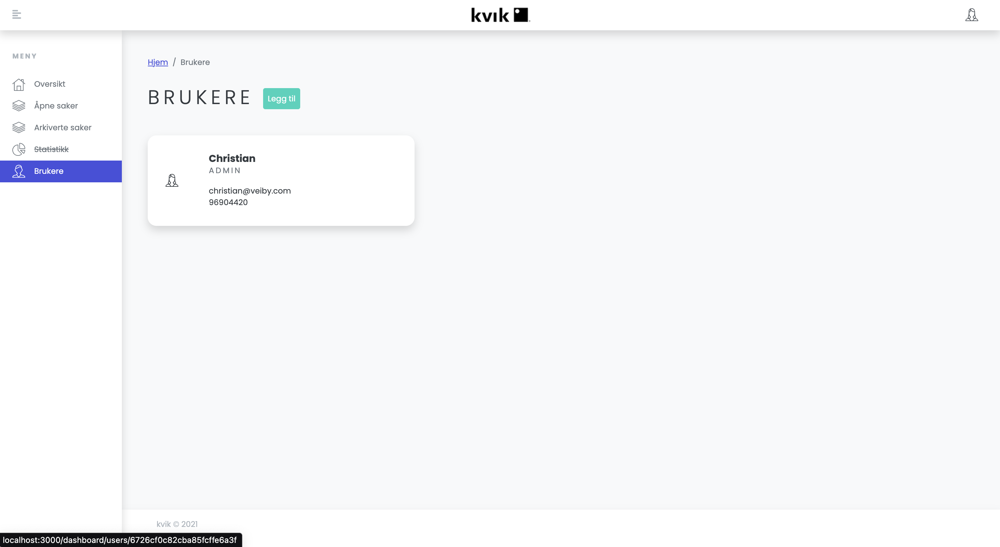

# Product Return System

_Disclaimer:_
This project was created with the intention of learning about frontend and backend development. For this reason the project is not maintained and is not intended for production use. The project is open source and can be used as a reference for learning purposes.

## Table of contents

- [Description](#description)
- [Graphics](#graphics)
- [Contact](#contact)

## Description

This project is a product return system, where users can register a return of a product. The project is built with a frontend and backend, where the frontend is built with View and the backend is built with Node.js. The project uses a NoSQL database to store data.

The website is divided into two main parts: the user part and the admin part. The user part is where users can register a return of a product. The admin part is where the admin can see all the returns that have been registered. Additional functionality includes:

- The ability to add new users and delete users.
- The ability to add new returns and delete returns.
- The ability to see all the returns that have been registered and filter based on parameters.
- Send automatic emails to users when a return has been registered.
- Create nodes related to return cases.

### Motivation

This project was created as a side project while studying economics at UIT Alta. The main motivation behind creating the project was educational aspects. As a newbie, who had never programmed anything of relevance before, this project was a great start for learning about backend, front-end and general project management.

## Graphics

### Landing page

### Form page

### Dashboard page

### Dashboard / User page

### Dashboard / Returns page

# Contact

If you have any questions or want to get in touch, you can reach me at:

- [Github](https://github.com/chrvei00)
- [LinkedIn](https://www.linkedin.com/in/christian-veiby)
- [christian@veiby.com](mailto:christian@veiby.com)
